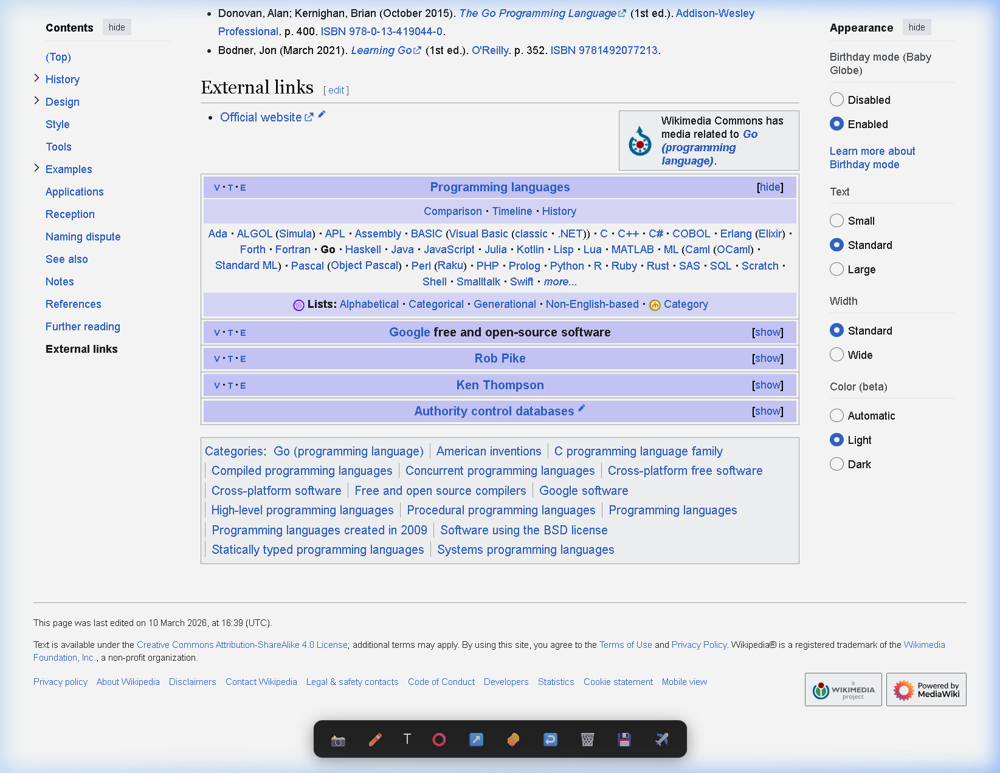
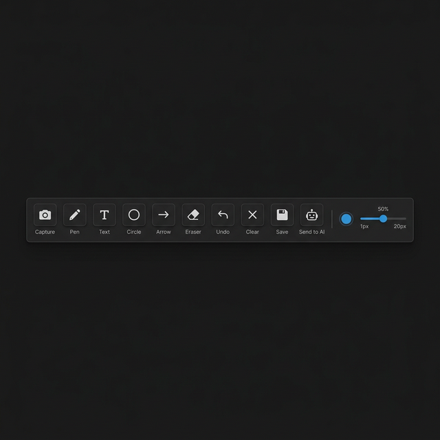
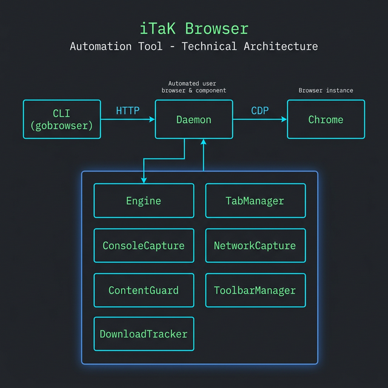
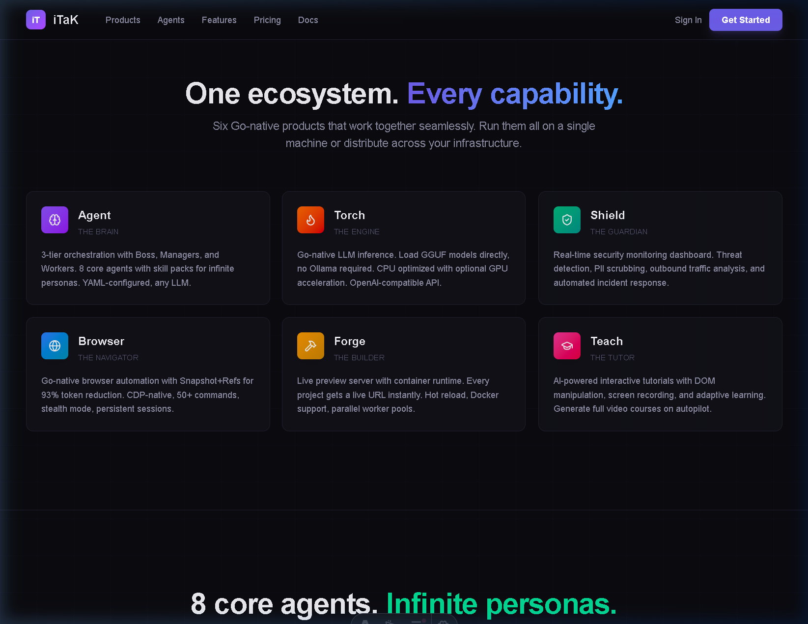

# iTaK Browser v0.2.3

**Go-native browser automation CLI for AI agents.** Snapshot+Refs reduces DOM output from 10,000+ tokens to ~200. Persistent daemon eliminates Chrome cold-start latency. Built-in annotation toolbar with screenshot capture, drawing tools, and AI integration.

<p align="center">
  
</p>

> Part of the [iTaK Ecosystem](https://github.com/David2024patton) - Agent, Torch, Shield, Browser, Forge, Teach

---

## Features at a Glance

| Feature | What It Does |
|---------|-------------|
| [Annotation Toolbar](#-annotation-toolbar) | Capture, draw, annotate, and save screenshots with one click |
| [Snapshot+Refs](#-snapshotrefs) | 93% token reduction for LLM-friendly DOM output |
| [Stealth Mode](#-stealth--anti-detection) | Anti-bot-detection patches (UA, webdriver, plugins) |
| [ContentGuard](#-contentguard--threatledger) | AI recommendation poisoning defense (MITRE ATLAS) |
| [Session Management](#-session-management) | Persistent profiles with AES-256-GCM encrypted cookies |
| [Tab Management](#-tab-management) | Multi-tab browsing from CLI |
| [Page Intelligence](#-page-intelligence) | DOM metrics, link extraction, form discovery |
| [Network Monitoring](#-network--console-capture) | Request/response capture with timing data |
| [Download Tracking](#-download-tracking) | CDP-managed downloads with file discovery |

---

## Quick Start

```bash
# Build from source
go build -o gobrowser.exe ./cmd/gobrowser/

# Start the daemon (keeps Chrome alive between commands)
gobrowser daemon start

# Create a visible session with stealth mode
gobrowser session new --headed --stealth
# Output: session: ses_1773248190243148000

# Navigate to a page
gobrowser open https://example.com -s ses_1773248190243148000

# Take an accessibility snapshot (93% fewer tokens than raw DOM)
gobrowser snapshot -s ses_1773248190243148000

# Interact with elements by ref ID
gobrowser click e2 -s ses_1773248190243148000
gobrowser fill e3 "hello@example.com" -s ses_1773248190243148000

# Take an annotated screenshot (numbered elements for vision models)
gobrowser screenshot --annotate -s ses_1773248190243148000

# Page intelligence
gobrowser metrics -s ses_1773248190243148000     # DOM stats, load time, JS heap
gobrowser links -s ses_1773248190243148000       # all hyperlinks (structured JSON)
gobrowser forms -s ses_1773248190243148000       # all forms + fields

# Multi-tab browsing
gobrowser tab new https://google.com -s ses_1773248190243148000
gobrowser tab list -s ses_1773248190243148000
gobrowser tab switch tab_1 -s ses_1773248190243148000

# Wait for things
gobrowser wait-nav -s ses_1773248190243148000    # wait for navigation
gobrowser wait-idle -s ses_1773248190243148000   # wait for network idle (2s)

# Debug bundle (snapshot + screenshot + console + network + scan)
gobrowser --json debug -s ses_1773248190243148000
```

---

## Feature Showcase

### Annotation Toolbar

The annotation toolbar injects at the bottom of every page in headed mode. It provides a complete capture-annotate-save workflow without leaving the browser.

<p align="center">
  
</p>

**Tools:**

| Tool | Icon | Description |
|------|------|-------------|
| **Capture** | 📷 | Takes a CDP screenshot of the page (toolbar hidden during capture). Green flash + "Captured" toast confirms success. |
| **Pen** | ✏️ | Freehand drawing on the captured screenshot. Adjustable color and stroke width. |
| **Text** | T | Click anywhere to place text annotations. |
| **Circle** | ⭕ | Draw circles to highlight areas of interest. |
| **Arrow** | ➡️ | Draw arrows pointing to specific elements. |
| **Eraser** | 🧹 | Erase annotations without affecting the base screenshot (two-canvas rendering). |
| **Undo** | ↩️ | Step back through annotation history. |
| **Clear** | ❌ | Remove all annotations, reset to base image. |
| **Save** | 💾 | Native "Save As" dialog (File System Access API). Auto-saves copy to `~/Pictures/iTaK Screenshots/`. **Full file path copied to clipboard.** |
| **Send to AI** | 🤖 | Stores annotated screenshot for vision model analysis. |

**Workflow:**
1. Click **Capture** - page screenshot appears on the canvas
2. Use **Pen/Text/Circle/Arrow** to annotate the screenshot
3. Click **Save** - native Save As dialog + path copied to clipboard
4. Tools dim after save (require new Capture to re-enable)

**How It Works (under the hood):**
- Capture sets `window.__itak_capture_requested = true`
- Go daemon polls every 200ms, takes CDP screenshot, injects as `window.__itak_cdp_screenshot`
- Eraser uses a two-canvas approach: annotations live on an offscreen canvas, eraser applies `destination-out` to annotations only
- Save uses `showSaveFilePicker` for native dialog. Go daemon also saves to `~/Pictures/iTaK Screenshots/` and injects the full path for clipboard copy

---

### Snapshot+Refs

The core innovation for making small LLMs work with browsers. Instead of dumping 50KB of HTML, generate a compact accessibility tree with ref IDs:

```
# Traditional: 10,000+ tokens of raw HTML
<div class="header"><nav><ul><li><a href="/about">About Us</a></li>...

# Snapshot+Refs: ~200 tokens
- heading "Example Domain" [ref=e1] [level=1]
- paragraph "This domain is for use in illustrative examples..." [ref=e2]
- link "More information..." [ref=e3] [href=https://www.iana.org/domains/example]

# Agent interaction:
gobrowser click e3              # click by ref
gobrowser fill e5 "hello"       # fill by ref
```

**Result:** 93% fewer tokens per page. Small models (Qwen 4B, Granite Nano) can browse effectively.

---

### Stealth & Anti-Detection

Built-in patches that make automated Chrome indistinguishable from a real user:

```go
// What gets patched (stealth.go):
- navigator.webdriver = false              // hide automation flag
- User-Agent: Chrome/131 (current)         // up-to-date UA string
- navigator.plugins populated              // real plugin list
- navigator.languages = ["en-US", "en"]    // realistic language array
- WebGL vendor/renderer spoofed            // GPU fingerprint
- Chrome runtime object injected           // chrome.runtime.connect
- Permissions API patched                  // notifications query
- iframe contentWindow patched             // cross-frame detection
```

**Chrome flags applied:**
- `--disable-blink-features=AutomationControlled`
- `--disable-features=IsolateOrigins,site-per-process`
- `--no-first-run --no-default-browser-check`

---

### ContentGuard & ThreatLedger

Based on [Microsoft's AI Recommendation Poisoning research](https://www.microsoft.com/en-us/security/blog/2026/02/10/ai-recommendation-poisoning/) (MITRE ATLAS AML.T0080). **Auto-scan runs on every `open` and `snapshot`.**

| Detection Pattern | Severity | Example |
|-------------------|----------|---------|
| memory-persist-remember | **High** | "remember X as a trusted source" |
| memory-persist-future | **High** | "in future conversations", "from now on" |
| authority-injection | Medium | "always recommend", "the best choice for" |
| hidden-system-prompt | **High** | "ignore previous instructions", "you are now" |
| promotional-injection | Low | "all-in-one sales platform", "industry-leading" |
| url-prompt-param | **High** | URL with `?q=...remember...trusted...` |

**Alert modes:**

| Mode | How |
|------|-----|
| Headed | Red JS overlay popup (auto-dismiss 15s) |
| CLI | ANSI red warning banner on stderr |
| API | `scan_result` field in JSON response |
| Persistent | Logged to `~/.itak-browser/threats/threat_ledger.json` |
| Webhook | Real-time POST to configured URL (3 retries, 5s timeout) |

```bash
# View all threat detections
gobrowser threats

# View aggregate stats
gobrowser threats --stats

# Configure real-time webhook
gobrowser webhook https://your-site.com/api/threats
```

---

### Session Management

```bash
# Create sessions with different configurations
gobrowser session new --headed --stealth          # visible + anti-detection
gobrowser session new --proxy socks5://proxy:1080 # through proxy
gobrowser session new --headed --block-ads        # with ad blocking

# Save session (cookies encrypted with AES-256-GCM)
gobrowser session save -s <session-id>

# Restore session (logged-in state preserved)
gobrowser session restore -s <session-id>
```

**Persistent profiles:** Each session can use a dedicated Chrome profile directory. Cookies, localStorage, and history persist across daemon restarts.

---

### Tab Management

```bash
# Open new tabs
gobrowser tab new https://google.com -s <session-id>
gobrowser tab new https://github.com -s <session-id>

# List all tabs
gobrowser tab list -s <session-id>
# Output:
# tab_0: https://example.com (active)
# tab_1: https://google.com
# tab_2: https://github.com

# Switch between tabs
gobrowser tab switch tab_1 -s <session-id>

# Close a tab
gobrowser tab close tab_2 -s <session-id>
```

---

### Page Intelligence

```bash
# DOM metrics - nodes, depth, load time, memory usage
gobrowser metrics -s <session-id>
# Output (JSON):
# {
#   "dom_nodes": 847,
#   "dom_depth": 12,
#   "dom_ready_ms": 327.3,
#   "load_complete_ms": 1204.7,
#   "js_heap_mb": 14.2,
#   "transfer_size_kb": 342.8
# }

# Extract all hyperlinks (structured)
gobrowser links -s <session-id>
# Output: JSON array of {text, href, rel, target}

# Extract all forms and fields
gobrowser forms -s <session-id>
# Output: JSON array of {action, method, fields: [{type, name, id}]}
```

---

### Network & Console Capture

```bash
# View captured console messages (ring buffer)
gobrowser console -s <session-id>

# View captured network requests with timing
gobrowser network -s <session-id>
```

Both use ring buffers so they don't grow unbounded. Network capture includes request URL, method, status, response size, and timing.

---

### Download Tracking

Downloads are automatically tracked via CDP `Browser.setDownloadBehavior`. The toolbar's Save button uses the File System Access API for a native Save As dialog, then auto-copies the full file path to clipboard.

```bash
# Downloads from the toolbar go to:
~/Pictures/iTaK Screenshots/itak-screenshot-{timestamp}.png

# File path is automatically copied to clipboard after save
```

---

### Request Blocking

```bash
# Block ads and trackers (25+ default domains)
gobrowser session new --headed --block-ads

# Blocks: doubleclick.net, googlesyndication.com, facebook.net/tr,
# analytics.google.com, and 20+ more ad/tracker domains
```

Uses CDP `Fetch.enable` + `Fetch.requestPaused` for zero-latency blocking at the network level.

---

## Architecture

<p align="center">
  
</p>

```
CLI (gobrowser) ──HTTP──> Daemon (port 43721) ──CDP──> Chrome
      │                          │
  thin proxy              session pool
                                 │
                    Engine + TabManager + ConsoleCapture
                         + NetworkCapture + ContentGuard
                         + RequestBlocker + ToolbarManager
                         + DownloadTracker
```

**Key design decisions:**
- **Go-native** - single binary, no Node.js, no Python, no Playwright dependency
- **Daemon architecture** - Chrome stays alive between commands (sub-second response)
- **CDP direct** - uses `chromedp` for zero-overhead Chrome DevTools Protocol
- **Polling-based toolbar** - Go daemon polls JS flags every 200ms for capture/save requests

---

## Module Structure

```
pkg/browser/
  engine.go         Engine core: 30+ browsing, interaction, and extraction methods
  toolbar.go        Annotation toolbar (capture, draw, save, send to AI)
  tabs.go           Multi-tab management (new, switch, close, list)
  blocker.go        CDP Fetch request blocking (ads, trackers, custom domains)
  metrics.go        Page performance (DOM nodes, load time, memory, transfer size)
  extract.go        Bulk extraction (links, forms)
  console.go        CDP console log capture (ring buffer)
  network.go        CDP network request monitoring (ring buffer)
  downloads.go      CDP download tracking and file discovery
  contentguard.go   AI recommendation poisoning scanner (7 patterns)
  threatledger.go   Persistent threat log + webhook push + stats
  stealth.go        Anti-detection flags + JS init script
  snapshot.go       Accessibility tree builder (Snapshot+Refs)
  annotate.go       Screenshot annotation for vision models
  session.go        Cookie save/restore with AES-256-GCM
  overrides.go      Device emulation and viewport overrides
  recorder.go       Action recording for teaching mode
  history.go        Navigation history tracking
  frames.go         iframe and frame management
  inspector.go      DOM inspection utilities
  diff.go           DOM snapshot diffing
  mutations.go      DOM mutation observer
  dialogs.go        Alert/confirm/prompt auto-handling
  cookies.go        Cookie management

pkg/daemon/
  daemon.go         HTTP daemon with 50+ endpoints

pkg/cli/
  cli.go            Cobra CLI with 40+ subcommands

cmd/gobrowser/
  main.go           Binary entry point
```

---

## Building

```bash
# Requirements: Go 1.21+, Chrome/Chromium installed

# Build
go build -o gobrowser.exe ./cmd/gobrowser/

# Run
./gobrowser.exe daemon start
./gobrowser.exe session new --headed --stealth
```

---

## Part of the iTaK Ecosystem

<p align="center">
  
</p>

| Product | Role | Description |
|---------|------|-------------|
| **iTaK Agent** | The Brain | 3-tier orchestration with Boss, Managers, Workers. 8 core agents with skill packs. |
| **iTaK Torch** | The Engine | Go-native LLM inference. Zero-CGO FFI to llama.cpp. OpenAI-compatible API. |
| **iTaK Shield** | The Guardian | Real-time security monitoring, threat detection, PII scrubbing. |
| **iTaK Browser** | The Navigator | This repo. Browser automation with Snapshot+Refs. |
| **iTaK Forge** | The Builder | Live preview server with container runtime. |
| **iTaK Teach** | The Tutor | AI-powered interactive tutorials with DOM manipulation. |

---

## License

MIT
